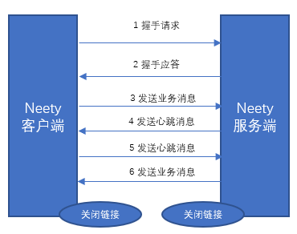

# Netty自定义协议栈开发

## 协议栈的功能描述

- 基于Netty的NIO通信框架，提供高性能的异步通信能力
- 提供消息的编解码框架，可以实现POJO的序列化和反序列化
- 提供基于IP地址的白名单接入认证机制
- 链路的有效性校验机制
- 链路的断连和重连机制

## 通信模型

- Netty协议客户端发送握手请求消息，携带节点ID等有效身份认证信息；
- Netty协议服务端对握手请求消息进行合法性检验；
  - 节点ID有效性检验
  - 节点重复登录校验
  - IP地址合法性校验（IP白名单校验）
- 链路建立成功后，客户端定期发送心跳消息；
- 链路建立成功后之后，客户端/服务端向对方发送业务消息；
- 服务端退出时，服务端关闭链接，客户端感知对方链接关闭，被动关闭客户端。

## 消息定义

Netty协议栈消息定义包含两个部分：

- 消息头

  | 名称   | 类型   | 长度 | 描述                                                     |
  | ------ | ------ | ---- | -------------------------------------------------------- |
  | header | Header | 变长 | 消息头定义                                               |
  | body   | Object | 变长 | 对于请求消息，它是方法的参数；对于响应消息，它是返回值。 |

  

- 消息头定义

  | 名称       | 类型               | 长度 | 描述                                                         |
  | ---------- | ------------------ | ---- | ------------------------------------------------------------ |
  | crcCode    | 整型int            | 32   | Netty消息的校验码，它由三部分组成： 1、0XABEF：固定值，表明该信息是Netty的协议消息，2个字节 2、主版本号：1~255，1个字节 3、次版本号：1~255，1个字节 crcCode=0XABEF + 主版本号 + 次版本号 |
  | length     | 整型int            | 32   | 消息长度，整个消息，包括消息头和消息体                       |
  | sessionID  | 长整形long         | 64   | 集群内唯一ID，有会话生成器生成。                             |
  | type       | Byte               | 8    | 0：业务请求消息 1：业务响应消息 2：业务ONE WAY消息（即是请求消息也是响应消息） 3：握手请求消息 4：握手响应消息 5：心跳请求消息 6：心跳响应消息  |
  | priority   | Byte               | 8    | 消息优先级：0~255                                            |
  | attachment | Map<String,Object> | 变长 | 可选字段，用于扩展消息头                                     |

## Netty协议的编解码规范

### Netty协议的编码

- crcCode：java.nio.ByteBuffer.put(int value)，如果采用其他缓冲区实现，必需与其等价。
- length：java.nio.ByteBuffer.put(int value)，如果采用其他缓冲区实现，必须与其等价。
- sessionID：java.nio.ByteBuffer.putLong(long value)，如果采用其他缓冲区，必须与其等价。
- type：java.nio,ByteBuffer.put(byte b)，如果采用其他缓冲区，必须与其等价。
- priority：java.nio.ByteBuffer.put(byte b)，如果采用其他缓冲区，必须与其等价。
- attachment：它的编码规则为--如果attachment长度为0，表示没有可选附件，则将长度编码设为0，java.nio.ByteBuffer.putInt(0)；如果大于0，说明有附件需要编码，具体的编码规则如下。
  - 首先对附件的个数进行编码，java.nio.ByteBuffer.put(attachment.size());
  - 然后对Key进行编码，先编码长度，再将它转换成byte数组之后，再编码value。
- body的编码：序列化成byte[]数组，然后再调用java.nio.ByteBuffer.put(byte[] src)将其写入到ByteBuffer中。

### Netty协议的解码

- crcCode：通过java.nio.ByteBuffer.getInt()获取校验字段，其他缓冲区需要和其等价。
- length：通过java.nio.ByteBuffer.getInt()获取Netty消息长度，其他缓冲区需要和其等价。
- sessionID：通过java.nio.ByteBuffer.getLong()获取会话ID，其他缓冲区需要和其等价。
- type：通过java.nio.ByteBuffer.get()获取消息类型，其他缓冲区需要和其等价。
- type：通过java.nio.ByteBuffer.get()获取消息优先级，其他缓冲区需要和其等价。
- attachment：调用java,nio.ByteBuffer.getInt()获取附件的长度，如果为0，说明附件为空。如果大于0，循环读取key和value。key通过java.nio.ByteBuffer.readString()，Value通过java.nio.ByteBuffer.readBinary()读取二进制数组，再转换成POJO。
- body：对二进制数组转换成POJO

## 链接的建立

- 客户端于服务端建立成功后，有客户端发送握手请求消息，握手请求定义：
  - 消息头type：值为3。
  - 可选附件：长度0。
  - 消息体：空。
  - 握手消息长度为32个字节。
- 服务端接收客户端的握手请求消息之后，如果IP校验通过，返回握手应答消息给客户端，应用层链路连接成功。
  - 消息头type：值为4。
  - 可选附件：长度0。
  - 消息体为byte类型结果，“0”表示认证成功；“-1”表示认证失败。

链路建立成功后，客户端和服务端就可以相互发送业务消息了。

## 链路的关闭

由于采用长连接通信，在正常的业务期间，双方通过心跳和业务消息维护链路，任何一方都不需要主动去关闭链路，但是在以下情况下，客户端和服务端需要关闭链接。

- 当对方宕机或者重启时，会主动关闭链路，另一方读取到操作系统的通知信号，得知对方REST链路，需要关闭链接，释放自身的句柄等资源。由于采用TCP全双工通信，通信双方都需要关闭连接，释放资源。
- 消息读写过程中，发生I/O异常，需要主动关闭链接。
- 心跳消息读写过程中发生I/O异常，需要主动关闭。
- 心跳超时，需要主动关闭链接。
- 发生编码异常等不可恢复错误时，需要主动关闭连接。

## 可靠性设计

### 心跳机制

具体设计思路：

- 当网络处于空闲状态，持续时间到达T（连续周期T没有读写消息）时，客户端主动发送Ping心跳消息给客户端。
- 如果在下一个周期T来到时客户端没有收到对方的Pong心跳应答消息或者读取到服务端发送的其他业务消息，则心跳失败计数器加1.
- 每当客户端接收到服务端的Pong应答消息或者业务消息时候，将心跳失败计数器清零；连续N次没有收到服务器的Pong消息或者业务消息，则关闭链路，间隔INTERVAL时间后发起重连操作。
- 服务端网络空闲状态持续时间到达T后，服务端将心跳失败计数器加1；只要接收到客户端发送的Ping消息或者其他业务消息，计数器清零。
- 服务端连续N次没有接收到客户端的Ping消息或者其他业务消息，则关闭链路，释放资源，等待客户端重连。

### 重连机制

- 如果链路中断，等待INTERVAL时间后，有客户端发起重连操作，如果重连失败，间隔周期INTERVAL后，再次发起重连，直到重连成功。
- 为了保证服务端有足够的时间释放句柄资源，在首次断连时客户端需要等待INTERVAL时间之后，才能再发起重连，而不是失败后就立即重连。
- 为了保证句SocketChannel、Socket等
- 重连失败后，需要打印异常堆栈信息，方便后续的问题定位。

### 重复登录保护

- 当客户端握手成功之后，在链路处于正常状态下，不允许客户端重复登录，以防止客户端在异常状态下反复重连，导致句柄资源耗尽。
- 服务端接收到客户端的握手请求消息之后，首先对IP地址进行合法性校验，如果校验成功，则缓存地址中查看客户端是否已经登录，如果已经登录，则拒绝重复登录，返回错误码-1，同时关闭TCP链路，并在服务端日志中打印失败的原因。
- 客户端接收到握手失败的应答消息后，关闭客户端TCP连接，等待INTERVAL时间后，再次发起TCP连接，直到认证成功。
- 为了防止由于服务端对链路状态理解不一致导致客户端无法握手成功的问题，当服务端连续N次心跳超时之后，需要主动关闭链路，清空客户端的地址缓存信息，以保证后续改客户端可以重连成功，防止被重复登录保护机制拒绝掉。

### 消息缓存重发

- 无论客户端还是服务器，当发生链路中断之后，在链路恢复之前，缓存在消息队列中待发送的消息不能丢失，等待链路恢复后，重新发送这些消息，保证链路中断期间消息不丢失。
- 考虑到内存溢出的风险，建议消息缓存队列设置上限，当到达上限后，应该拒接继续向该队列添加新消息；还有一种更通用的做法是提供通知机制，将发送失败的消息通知给业务侧，让业务侧做决定：是丢弃还是缓存重发。

## 安全性设计

- 为了保证整个集群环境的安全，内部长连接采用基于IP地址的安全认证机制，服务端对握手请求消息的IP地址进行合法性校验；如果在白名单之内，则通过校验；否则，拒接对方连接。
- 如果将Netty协议栈放到公网中使用，需要采用更加严格的安全认证机制，例如基于密钥和AES加密的用户名+ 密码认证机制，也可以采用SSL/TSL安全传输。
- 本实例使用简单的IP白名单认证机制。

## 可扩展性设计

- Netty协议需要一定的扩展能力，业务可以在消息头中自定义业务域字段，例如消息流水号，业务自定义消息头等。通过Netty消息头中可选附件attachment字段，业务可以方便地进行自定义扩展。

- Netty协议栈架构需要具备一定的扩展能力，例如统一的消息拦截，接口日志，安全，加解密等可以被方便添加和删除，不需要修改之前的逻辑代码，类似Servlet的FilterChain和AOP，但是考虑到性能因素，不推荐通过AOP来实现功能的扩展。

